# 视频去水印方法总结（附源码）

从素材网站下载的视频大多都留有水印，使用这些视频对使用者有较大干扰，很不方便，需要运用一定的方法尽可能去掉。通过查阅资料，视频去水印有以下常见的几种方法：
    
1. 对视频空间区域进行裁剪，仅保留干净的部分，当水印logo在视频边边角角时比较管用，如优酷视频、腾讯视频以及电视台logo等。虽然这样会损失一部分内容，但大多数情况下能够保留主要部分，可以使用格式工厂、狸窝等视频编辑软件完成该操作。
2. 对水印区域进行模糊处理，这种处理方式很常见，使用者还经常在原来的水印区域加上新的水印orz...，当水印遮盖的区域较光滑时效果极好，否则也会丢失logo下的细节，可以用爱剪辑完成该操作，不过蛋疼的是它会强制加入片头和片尾。
3. 基于（成熟的）去水印算法进行处理，据我所知最好的是Google论文[On the Effectiveness of VisibleWatermarks](http://openaccess.thecvf.com/content_cvpr_2017/papers/Dekel_On_the_Effectiveness_CVPR_2017_paper.pdf)里提到的优化算法，该算法针对图片水印进行处理，当水印在多张图间完全一样时有奇效，水印去得干干净净，这里有一个[python版开源实现](https://github.com/rohitrango/automatic-watermark-detection)，效果略差于论文，另外，该算法速度特别慢，在训练完成后处理单张图片用时几秒到几十秒不等，对于视频处理就不能指望了，但可以考虑在稍微降低品质的条件下对该算法进行优化提速。
4. 简单粗暴的水印减除，拿到一个视频，想方设法获得水印图片，假设一个透明度，通过加水印的反向操作，获得大致无水印的结果，该方法不能除尽水印，但若不仔细看，残留的部分也不太明显。

在我遇到的情况下，主要有来自不同网站的五种水印，模糊处理代价太大，Google的算法速度太慢，实践起来难度不小，没有过多研究，如图1-5是水印减除前后的效果

<div align="center">
   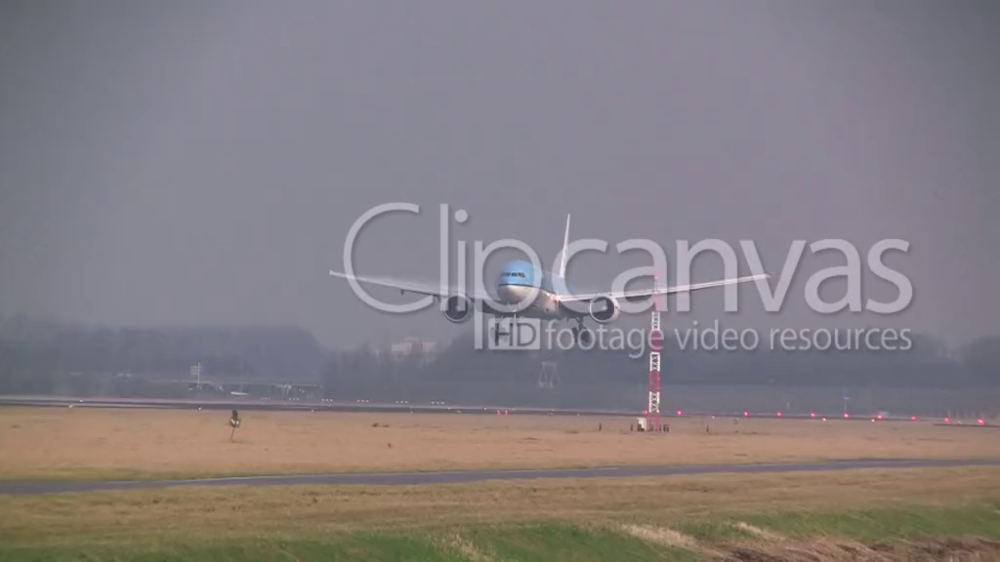
   <br>
   <caption><center> <u><b> 图 1 </b></u>: <b> ClipCanvas </b><br> </center></caption>
   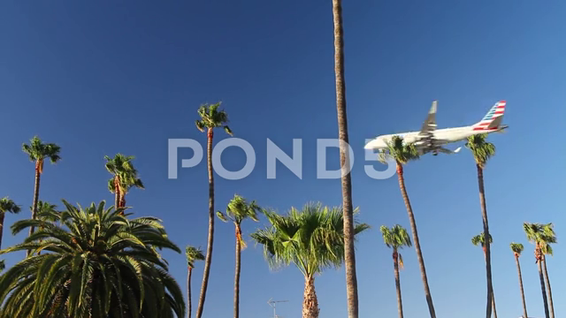
   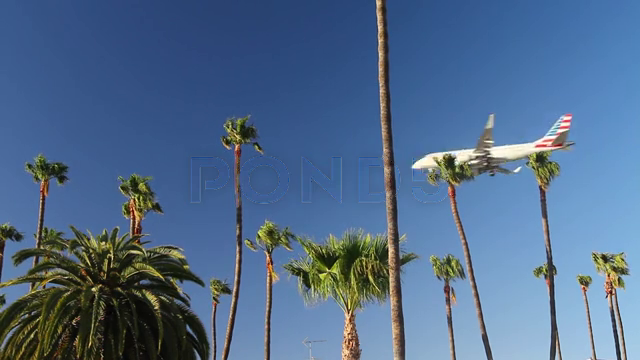<br>
   <caption><center> <u><b> 图 2 </b></u>: <b> Pond5 </b><br> </center></caption>
   
   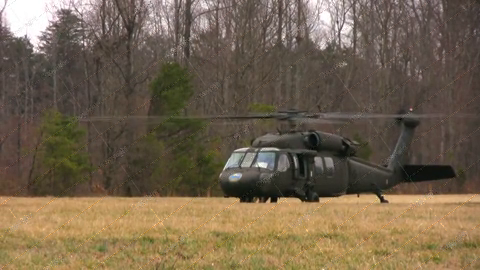<br>
   <caption><center> <u><b> 图 3 </b></u>: <b> Copyright(quanjing) </b><br> </center></caption>
   
   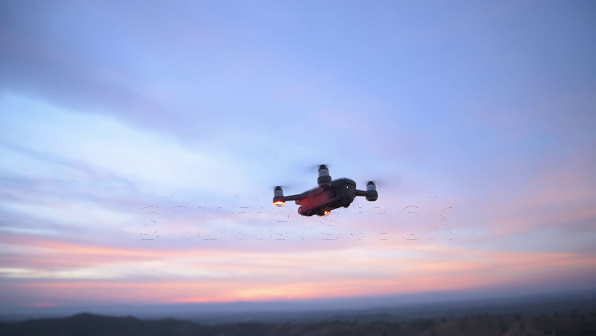<br>
   <caption><center> <u><b> 图 4 </b></u>: <b> ShutterStock </b><br> </center></caption>
   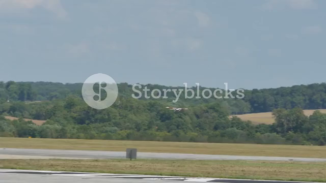
   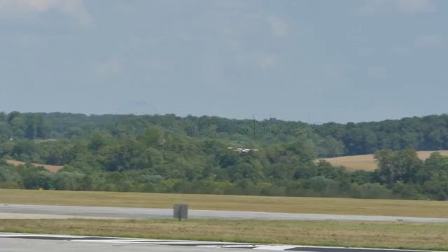<br>
   <caption><center> <u><b> 图 5 </b></u>: <b> StoryBlocks </b><br> </center></caption>
</div>

## 水印减除方法介绍

### 原理简介
我们知道添加水印方法是

<div align="center">
<a href="http://www.codecogs.com/eqnedit.php?latex=J&space;=&space;\alpha&space;*&space;W&space;&plus;&space;(1&space;-&space;\alpha)&space;*&space;I" target="_blank"></a>
</div>

其中*I*是原图、*W*是logo图，*J*分别是添加logo之后的水印图，*α*是原图的透明度，*α=0*时完全看不到水印，*α=1*时，水印将完全覆盖原图，在没有水印的区域*α=0*，因此，求解原图的公式为

<div align="center">
<a href="http://www.codecogs.com/eqnedit.php?latex=I&space;=&space;\frac{J&space;-&space;\alpha&space;*&space;W}{1&space;-&space;\alpha}" target="_blank"></a>
</div>

若已知*W*和*α*，就能求*I*。

### 从纯色背景中提取水印图*W*，手动估计*α*

一般情况下透明度是一个常数，即logo的各个位置的*α*相同，本文中遇到的水印图片皆为灰白色，各颜色通道的值相同（不同也OK），假设水印为白色透明的文字，很自然可以想到利用纯黑色背景的图像获得该文字水印，可以进一步假设白色文字的颜色为255，即*W=255*，*α*(logo在水印图的占比)也就是<a href="http://www.codecogs.com/eqnedit.php?latex=\alpha=\frac{J_{max}}{255}" target="_blank"></a>，相反，如果水印强度不一致，则可以假设一个*α*（可以选择该图中较大的灰度值除以255，不是最大的灰度值，因为图片和视频压缩产生噪声的缘故，见下文），<a href="http://www.codecogs.com/eqnedit.php?latex=W=\frac{J_{max}}{\alpha}" target="_blank"></a>，本文中的水印图W，alpha通道图以及消减后结果（以下简称**消减图**）如图6-10，

<div align="center">
   
   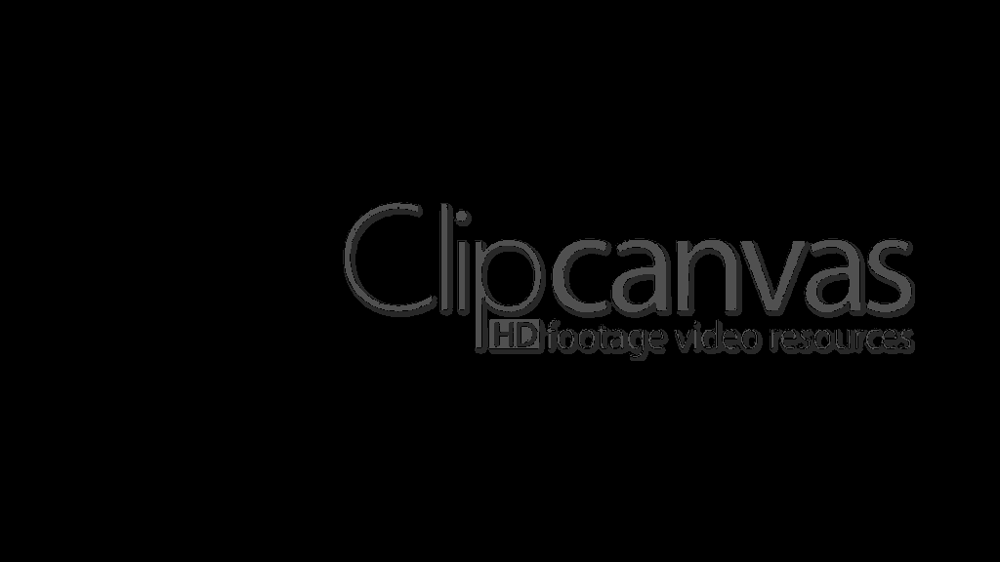
   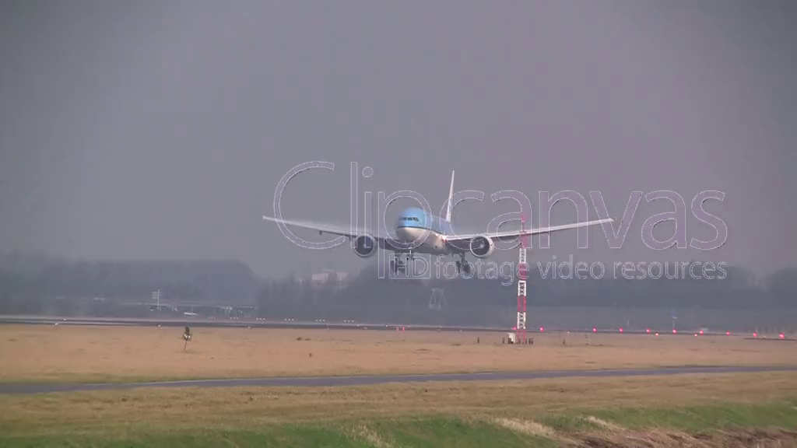<br>
   <caption><center> <u><b> 图 6 </b></u>: <b> ClipCanvas的W,alpha和消减图 </b><br> </center></caption>
   
   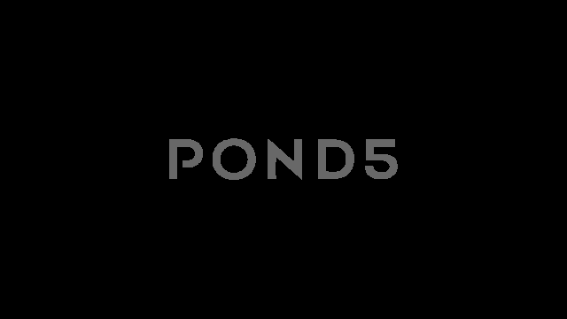
   <br>
   <caption><center> <u><b> 图 7 </b></u>: <b> Pond5的W,alpha和消减图 </b><br> </center></caption>
   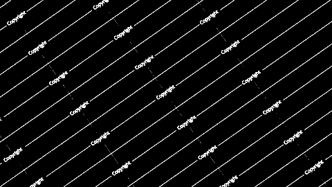
   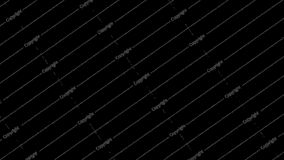
   <br>
   <caption><center> <u><b> 图 8 </b></u>: <b> Copyright(quanjing)的W,alpha和消减图 </b><br> </center></caption>
   
   
   <br>
   <caption><center> <u><b> 图 9 </b></u>: <b> ShutterStock的W,alpha和消减图 </b><br> </center></caption>
   
   
   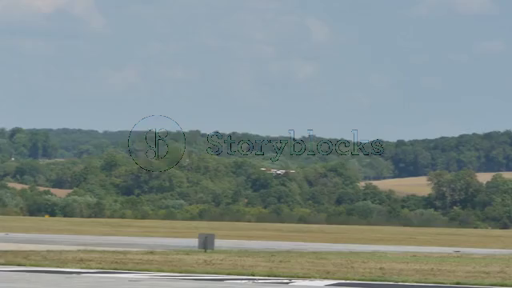<br>
   <caption><center> <u><b> 图 10 </b></u>: <b> StoryBlocks的W,alpha和消减图 </b><br> </center></caption>
</div>

水印强度不一致的Logo，有时候仅从黑色背景下提取亮色区域是不够，还需要从白色背景下提取暗色背景。

**问题：如何获取纯色背景下带有水印的图片？**

1. 从视频源网站找，或者利用爬虫大量下载后来挑选
2. 上传包含纯黑和纯白帧的视频，通过平台自动添加水印

### 利用中值滤波减弱边缘噪声

从上一步处理的结果来看，logo边缘处理效果不太好，跟椒盐噪声很相似，如图11，这通常是由于制作logo时的抗锯齿效果（见下文），使得logo的边缘虚化导致。为了处理这些区域，考虑使用中值滤波修复这些区域，如果直接对整个水印区域进行中值滤波，虽然可以将水印去除干净，但信息损失量很大，使原本分辨率不高的视频变得更加模糊，如图12；另一方面，如果能够定位这些区域，仅替换这些坏的区域，则能得到一个折中的效果。

<div align="center">
<br>
<caption><center> <u><b> 图 11 </b></u>: <b> 消减图细节 </b><br> </center></caption>
<br>
<caption><center> <u><b> 图 12 </b></u>: <b> 中值滤波后的消减图细节 </b><br> </center></caption>
</div>

定位这些区域的简单办法是将消减图和其中值滤波图像相减，取绝对值，得到**差值图**，目标区域则是这些差值较大的像素，为了减少误差，可以用多个差值图求中值或均值，取一个阈值，将较小的噪声置零，得到最终差值图如图13，利用该差值图替换消减图中的像素点，获得接近原图的处理结果，如图14，如此形成了一个不甚完美的简单解决方案。

<div align="center">
<br>
<caption><center> <u><b> 图 13 </b></u>: <b> 多张差值图的中值图像 </b><br> </center></caption>
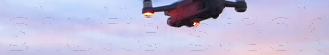<br>
<caption><center> <u><b> 图 14 </b></u>: <b> 对指定区域模糊后的图像 </b><br> </center></caption>
</div>

## 关于图片的细节

### 1、 抗锯齿

为什么消减图的边缘处理效果不好？因为制作水印图时抗锯齿处理会使我们绘制的黑白图像中存在其他颜色像素，我们得到的时不纯的水印图。什么是抗锯齿？抗锯齿就是修改图像边界的像素值，使看起来更加圆润，为什么要抗锯齿？因为显示器的像素是离散的，与真实世界不同，坚持非黑即白会让图像很难看，抗锯齿能减少这种缺陷的影响，玩过很多视频游戏的人肯定不陌生。
举个例子，假设你要制作一个logo水印图，内容是“**Dove**”，外面包裹一个椭圆，打开windows画图板，制作该图如图15，理想情况下会以为整个图像中除了黑色像素就是白色像素，其实不然，将图像放大三倍如图16，发现“**Dove**”附近有许多其他颜色的像素，而椭圆的边缘是明显的锯齿状，反过来从原图中也可以看出来，“**Dove**”的字母很圆润，这种对于边界的处理叫**抗锯齿**，许多图片编辑工具都会默认抗锯齿处理，比如在画图板中的**铅笔**工具没有抗锯齿，但**刷子**工具会做抗锯齿处理，有空可以试一下Photoshop。

<div align="center">
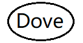<br>
<caption><center> <u><b> 图 15 </b></u>: <b> Dove水印图 </b><br> </center></caption>
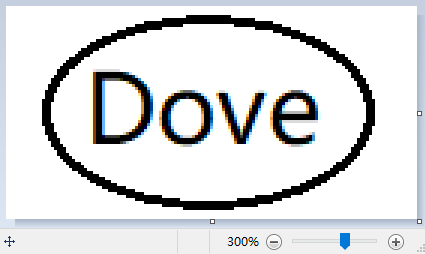<br>
<caption><center> <u><b> 图 16 </b></u>: <b> 放大3倍的Dove水印图 </b><br> </center></caption>
</div>

### 2、 图像与视频压缩编码

若纯黑背景下水印图Logo的灰度看起来一致，在计算alpha时为什么不选择最高灰度值除以255？因为图像压缩产生了其他分量，这些分量比原来更亮或更暗。
举个例子，打开windows画图板，填充背景为纯黑，画一个无需抗锯齿的图像，选择矩形，填充选择纯色，颜色1（前景色）取黑色RGB=(0,0,0)，颜色2（背景色）取接近白色的灰色RGB=(230,230,230)，随手画一个矩形，如图17所示，分别另存为bmp、jpg图像，然后重新打开bmp图像另存为png图像(否则是在jpg图像的基础上另存为png)，用软件查看图片几乎是一模一样的，但是bmp图像的大小是jpg的几十倍，bmp是未经压缩的原图，逐个像素保存，体积较大，而jpg和png都使用了图像压缩算法。

<div align="center">
<br>
<caption><center> <u><b> 图 17 </b></u>: <b> 矩形水印图 </b><br> </center></caption>
</div>

这里使用python的opencv和numpy工具查看像素值的详情，jpg图像除了0和230外，还有在0和230附近还有其他分量，而png是无损压缩格式，没有产生其他分量。

```python
>>> import cv2 as cv
>>> import numpy as np
>>> img_bmp = cv.imread("imgs/image_format.bmp")
>>> img_jpg = cv.imread("imgs/image_format.jpg")
>>> img_png = cv.imread("imgs/image_format.png")

>>> np.bincount(img_bmp.reshape(-1),minlength=256)
array([24969,     0,     0,     0,     0,     0,     0,     0,     0,
           0,     0,     0,     0,     0,     0,     0,     0,     0,
                                    ... 23行0 ...
           0,     0,     0,     0,     0,  4212,     0,     0,     0,
           0,     0,     0,     0,     0,     0,     0,     0,     0,
           0,     0,     0,     0,     0,     0,     0,     0,     0,
           0,     0,     0,     0], dtype=int64)

>>> np.bincount(img_jpg.reshape(-1),minlength=256)
array([24738,   189,    33,     6,     3,     0,     0,     0,     0,
           0,     0,     0,     0,     0,     0,     0,     0,     0,
                                    ... 23行0 ...
           0,     6,     3,    21,   309,  3816,    27,    18,     6,
           3,     3,     0,     0,     0,     0,     0,     0,     0,
           0,     0,     0,     0,     0,     0,     0,     0,     0,
           0,     0,     0,     0], dtype=int64)

>>> np.bincount(img_png.reshape(-1),minlength=256)
array([24969,     0,     0,     0,     0,     0,     0,     0,     0,
           0,     0,     0,     0,     0,     0,     0,     0,     0,
                                    ... 23行0 ...
           0,     0,     0,     0,     0,  4212,     0,     0,     0,
           0,     0,     0,     0,     0,     0,     0,     0,     0,
           0,     0,     0,     0,     0,     0,     0,     0,     0,
           0,     0,     0,     0], dtype=int64)
```
请自行百度一下jpg和png的压缩算法：）。

常见的视频编码如mp4格式等，也是有损压缩的，与图像压缩一样，原来图像中的灰度分量一般都会泄露到邻近的分量上去，视频压缩中更重要的是帧间压缩，比如每10帧为一段，每段只存1个关键帧以及帧间信息，其余9帧依靠关键帧还原回来，在播放时需要持续不断地解压，需要大量的计算支持，有专门的硬件解码器会很快，软件解码器也可以，如果没有硬件和软件的支持，就打不开这种格式的视频文件。有兴趣的可以了解下H.264 (H.265)

本文源码的GitHub地址：https://github.com/ziweipolaris/watermark-removal.git

推荐参考其中shutterstock水印的去除